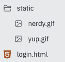

# Client/Server Logins

Waaay back when we learned about **repl.db**, we mentioned the idea of a **client/server** model for storing data in one place and dishing it out to multiple users. This model is the way we overcome the issue with repl.db of each user getting their own copy of the database.

Well, now we can use Flask as a webserver. We can build this client server model to persistently store data in the repl (the **server**) and have it be accessed by multiple users who access the website via the URL (the **clients**).


## Get Started

Previously, we have built login systems using Flask & HTML. We're going to start with one of those systems and adapt it to use a dictionary instead.

👉 First, let's remind ourselves of the way the system works. Here's the Flask code. Read the comments for explanations of what it does:

```python
from flask import Flask, request, redirect
# imports request and redirect as well as flask

app = Flask(__name__, static_url_path='/static')
# path to the static file that stores my images

users = {}
users["david"] = {"password" : "Baldy1"}
users["katie"] = {"password" : "k8t"}
# A dictionary hard coded into the program that stores the login details for two users


@app.route('/login', methods=["POST"])
def login():
  form = request.form
 
  try:
    if users[request.form["username"]]["password"]== request.form["password"]:
      return redirect("/yup")
    else:
      return redirect("/nope")
  except:
    return redirect("/nope")
# Login checking code - uses POST because it's dealing with usernames & passwords so we want encryption

# If the user details are correct, they get a lovely success gif, if not, they get a 'nope' gif.

# Try except used to load the 'nope' in case there's an error.

@app.route("/nope")
def nope():
  return """"""

@app.route("/yup")
def yup():
  return """"""

# The two methods above load the relevant gif depending on the result of the '/login' method

@app.route('/')
def index():
  page = ""
  f = open("login.html", "r")
  page = f.read()
  f.close()
  return page

# Loads the login HTML page that I've built separately on run.

app.run(host='0.0.0.0', port=81)


```

## Static Folder
👉 I've also created a 'static' folder with my gifs, and I've written a basic login HTML page in a separate file called `login.html`.



👉 Here's the code for that HTML login form:

```html
<form method="post" action="/login">
  <p>Username: <input type="text" name="username" required></p>
  <p>Password: <input type="password" name="password" required></p>
  <button type="submit">Log in</button>
</form>
```

The **problem** with this technique is that the dictionary is hard coded into the flask code.

### On the next page, we're going to look at how to use a db for the login details.