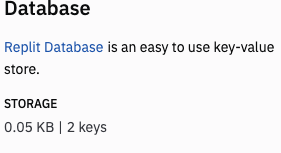

# Store and Use Data

👉 To replace the dictionary with a database, first I need to import repl.db.


```python
from flask import Flask, request, redirect
from replit import db

```

## Storing The Data
👉 Next, I'm going to delete the line that defines the dictionary and change the assignment of the next two lines to store the data in the database instead.

```python
db["david"] = {"password" : "Baldy1"}
db["katie"] = {"password" : "k8t"}

```
👉 Now **run the program** to add the data to the dictionary. I can tell that it's worked because the database pane now shows 2 keys:


👉 Then **comment out these lines** - you don't want to add the data more than once.

```python
#db["david"] = {"password" : "Baldy1"}
#db["katie"] = {"password" : "k8t"}

```

## Using The Data

👉 Now I'm going to change my `login` subroutine to reference the database instead of the `users{}` dictionary.

```python
@app.route('/login', methods=["POST"])
def login():
  form = request.form
  try:
    if db[request.form["username"]]   ["password"]== request.form["password"]:
      return redirect("/yup")
    else:
      return redirect("/nope")
  except:
    return redirect("/nope")
```

### Try it out!