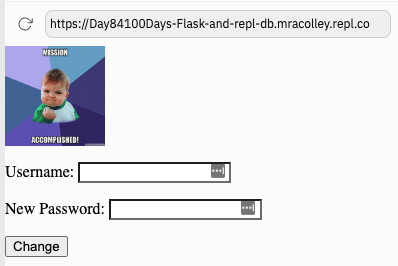
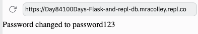

# Change Data

Now that we have a dictionary we can give users the option to edit their data. I'm going to make it so that the change password option is given on the successful login screen.

👉 First, I need a quick `change.html` page to create the form:  


```html
<form method="post" action="/changePass">
  
  <p>Username: <input type="text" name="username" required></p>
  <p>New Password: <input type="password" name="newPassword"></p>
  
  <button type="submit">Change</button>
</form>

```


👉 Next, I'm going to add the form to my successful login screen.  That's the `yup` subroutine. To do this I have:
1. Assigned the gif to a page variable instead of returning it.
2. Borrowed the file open & read code from my `index` subroutine and adapted it to open & read the `change.html` file.
3. Used `+=` in the `page += f.read()` line to add the contents of the `change.html` file to the successful login page.

```python
@app.route("/yup")
def yup():
  page = """"""
  f = open("change.html", "r")
  page += f.read()
  f.close()
  return page

```
Now when I login, I get the change password form underneath my successful login gif.



👉 However, this won't do anything without an `app.route`, so let's write that next.

## App Route
This code will update the database with any new password set.  It will also display the updated password on the screen *for testing only*. I don't need to tell you not to do this IRL right?

```python
@app.route("/changePass", methods=["POST"])

def change():
  form = request.form
  
  db[request.form["username"]] ["password"]= request.form["newPassword"]
  return f"""Password changed to {request.form['newPassword']}"""

```

Changing a password now should get you a message like this:



### Now, we can test this out by changing passwords and then trying to login with the new password.

