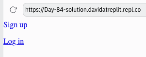
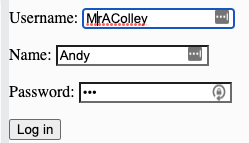

# 👉 Day 84 Challenge

Today's challenge is to build a flask website with a signup form.

The signup form should:

1. Ask for name, username and password.
2. Create a user account in a repl db usnig these details.
3. Direct you to the login form, which gets username and password as input.
4. If the details are valid, 'Hello' and the user's name should be displayed on screen.
    
Example:

 
 💡 Hints 

- Get the keys form the database using `db.keys`  
- Use `if form["username"] not in keys` to check if the user exists or not.

